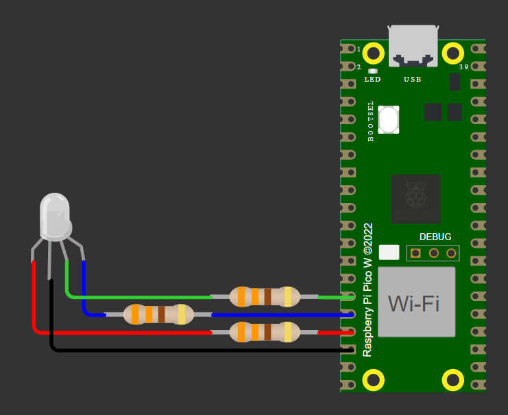
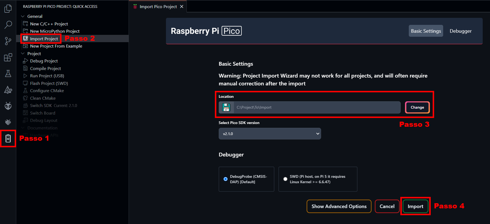
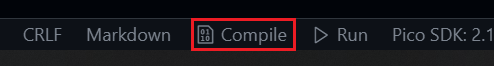
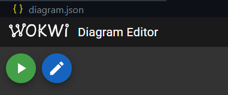

# Utilizando interrupções para gerenciar um semáforo com o RP2040

## Sumário

1. [💡 O que é este projeto](#1--o-que-é-este-projeto)
2. [⚡ Diagrama do hardware](#2--diagrama-do-hardware)
3. [🎥 Vídeo demonstrativo](#3--vídeo-demonstrativo)
4. [🔎 Funcionalidades disponíveis](#4--funcionalidades-disponíveis)
5. [🧰 Pré-requisitos para executar](#5--pré-requisitos-para-executar)
6. [💻 Como executar a simulação](#6--como-executar-a-simulação)
7. [🐶 Como executar o código na placa BitDogLab](#7--como-executar-o-código-na-placa-bitdoglab)

## 1. 💡 O que é este projeto

Este é um firmware escrito em C que utiliza o recurso de interrupções do RP2040 para controlar um semáforo. As cores mudam de acordo com o tempo especificado em uma das macros.

## 2. ⚡ Diagrama do hardware

Os componentes são conectados de acordo com o esquema abaixo:

## 3. 🎥 Vídeo demonstrativo

Uma demonstração do projeto em funcionamento pode ser assistida no link abaixo:

...

## 4. 🔎 Funcionalidades disponíveis

Ao iniciar a placa, o semáforo acende em vermelho e muda de cor a cada 3 segundos, seguindo a ordem:

`VERMELHO` > `AMARELO` > `VERDE`

Após 3 segundos no estado verde, o semáforo sempre volta para o vermelho e o ciclo recomeça.
Caso haja algum erro que o faça sair desse ciclo, o semáforo se apaga até que o sistema seja reiniciado.

## 5. 🧰 Pré-requisitos para executar

A configuração sugerida para executar o projeto é:

1. Ter o [Pico SDK](https://github.com/raspberrypi/pico-sdk) instalado na sua máquina;
2. Ter o [ARM GNU Toolchain](https://developer.arm.com/Tools%20and%20Software/GNU%20Toolchain) instalado na sua máquina;
3. Ter o [Visual Studio Code](https://code.visualstudio.com/download) instalado na sua máquina;
4. Ter este repositório clonado na sua máquina;
5. Ter as seguintes extensões instaladas no seu VS Code:
- [C/C++](https://marketplace.visualstudio.com/items?itemName=ms-vscode.cpptools);
- [CMake](https://marketplace.visualstudio.com/items?itemName=twxs.cmake);
- [CMake Tools](https://marketplace.visualstudio.com/items?itemName=ms-vscode.cmake-tools);
- [Raspberry Pi Pico](https://marketplace.visualstudio.com/items?itemName=raspberry-pi.raspberry-pi-pico);
- [Wokwi Simulator](https://marketplace.visualstudio.com/items?itemName=Wokwi.wokwi-vscode);
6. Ter uma placa BitDogLab disponível e pré configurada na sua máquina;

## 6. 💻 Como executar a simulação

Com os pré-requisitos atendidos, siga os passos a seguir:

1. Utilize o a extensão do Raspberry Pi Pico para VS Code para importar o projeto clonado:

2. Após carregar o SDK, clique em "Compile", à direita da barra de status e aguarde o processo:

3. Abra o arquivo `diagram.json` e clique no botão de play para iniciar a simulação:

4. Quando a simulação iniciar, teste o firmware conferindo se a **ordem das cores** e o **tempo em que cada status permanece aceso** atende ao que está especificado neste documento.

## 7. 🐶 Como executar o código na placa BitDogLab

1. Execute a primeira instrução do tópico anterior e aguarde o carregamento do SDK;

2. Ligue a placa BitDogLab;

3. Pressione e segure o botão `BOOTSEL` no Raspberry Pi Pico W;

4. Pressione o botão `RESET` na BitDogLab;

5. Solte os botões dos passos 3 e 4;

6. Conecte a placa ao computador via USB;

7. Pressione o botão "Run" na barra inferior do VS Code.

Após a transferência, a placa reiniciará com o programa em execução.

Observação:

- Como alternativa ao passo 7, é possível transferir o arquivo `.uf2` presente na pasta `build` para o armazenamento da placa.
